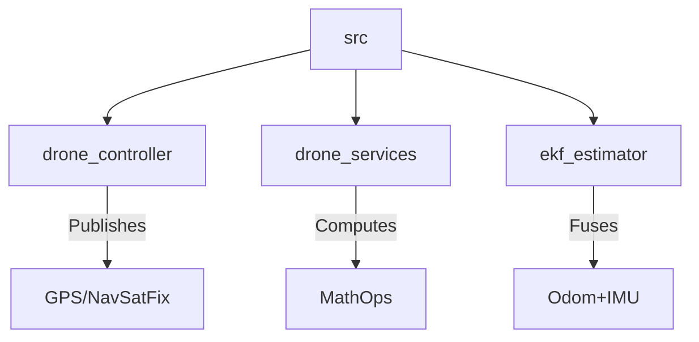

# 🚁 ROS 2 Drone State Estimation


> **Advanced State Estimation & Control Simulation using Extended Kalman Filters.**

This project implements a modular ROS 2 workspace designed for simulating and estimating the state of a drone. It features a custom controller, a service-based architecture for computations, and a robust **Extended Kalman Filter (EKF)** for fusing Odometry and IMU data.

---

## 📂 Project Structure

The workspace is organized into three core packages, consolidated for clarity and modularity:



- **🎮 `drone_controller`**: Directs drone navigation and acts as the driver interface.
- **🛠️ `drone_services`**: Provides computational services to offload heavy calculations.
- **🧠 `ekf_estimator`**: The brain of the operation. Implements EKF with **3D, 7D, and 8D** state vectors.

---

## ⚡ Performance Reports & Results

We evaluated our Kalman Filters under three distinct scenarios to ensure robustness.

### 1. Base Configuration (Ideal Conditions)
*Standard operation with minimal noise.*

| Position Estimation | Velocity Estimation |
|:---:|:---:|
|  |  |
| **Observation**: The 3D model is fast, but 8D offers superior trajectory smoothnes. | **Observation**: Velocity profiles are stable across all filters. |

### 2. High Measurement Noise (Sensor Errors)
*Increased covariance in GPS/Odometry readings.*

| Position Estimation | Velocity Estimation |
|:---:|:---:|
|  |  |
| **Observation**: The 3D model deviates significantly. The 8D model remains robust. | **Observation**: High frequency noise is filtered out effectively by higher order models. |

### 3. High Process Noise (Model Uncertainty)
*Increased uncertainty in the drone's motion model (wind, turbulence).*

| Position Estimation | Velocity Estimation |
|:---:|:---:|
|  |  |
| **Observation**: The 3D filter handles simplicity well here, while 8D struggles with complex dynamics prediction errors. | **Observation**: Velocity estimates become noisier but remain bounds. |

---

## 🚀 Usage

### Installation
```bash
git clone git
cd <repo_directory>
colcon build --symlink-install
source install/setup.bash
```

### Running the Modules
**Control System:**
```bash
ros2 run drone_controller drone_publisher
```

**State Estimator (Choose your fighter):**
```bash
# Fast & Lightweight
ros2 run ekf_estimator ekf_estimation_3d

# Precision Optimized
ros2 run ekf_estimator ekf_estimation_8d
```

---

<p align="center">
  <i>Developed for the Advanced Robotics Course - Practice 3</i>
</p>
