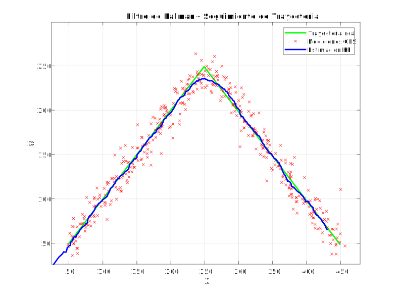
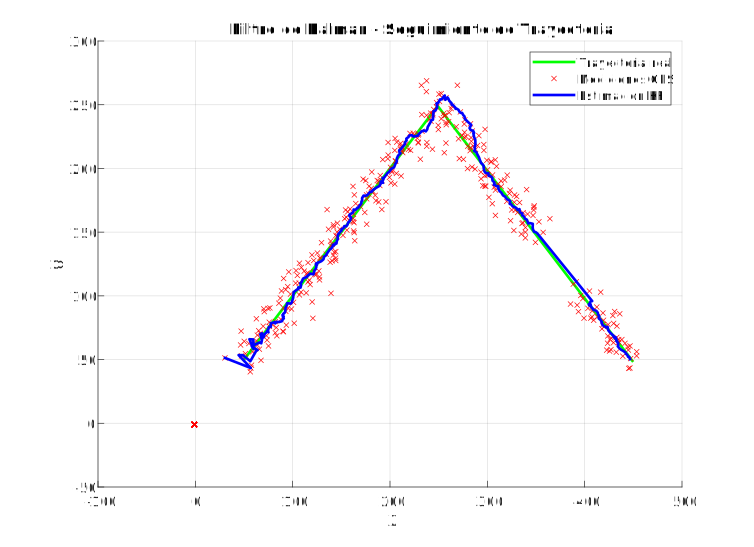
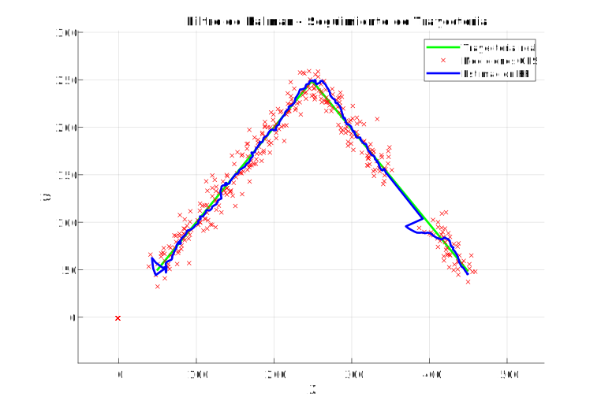

# 🚁 ROS 2 Drone State Estimation

> **Advanced State Estimation & Control Simulation using Extended Kalman Filters.**

This project implements a modular ROS 2 workspace designed for simulating and estimating the state of a drone. It features a custom controller, a service-based architecture for computations, and a robust **Extended Kalman Filter (EKF)** for fusing Odometry and IMU data.

---

## 🧮 MATLAB Prototyping

To validate the algorithms before deployment, we developed prototype implementations of **Standard Kalman Filters** in MATLAB. These scripts demonstrate the core logic used for state estimation.
*(See graphs below in the Performance Reports section)*

- **`FK1.m`**: **Basic 2D Position Tracking**

  - Uses a simple state vector `[x, y]`.
  - **Process Model**: Constant position with random walk.
  - **Observation**: Direct noisy position measurements.

  

    
  

- **`FK2.m`**: **Constant Velocity Model with Signal Loss Simulation**
  - Expanded state vector `[x, y, vx, vy]`.
  - **Process Model**: Constant velocity kinematics.
  - **Observation**: Position only.
  - **Feature**: Simulates GPS signal loss (missing data) and relies on prediction steps during outages.

  

    
  

- **`FK3.m`**: **Advanced Velocity Inference**
  - Uses the same Constant Velocity Model as `FK2`.
  - **Feature**: Observation matrix includes previous states to better infer velocity from position changes.
  - Also handles missing measurement data.

  

    
  

---

## ⚡ Standard Kalman Filter Performance Reports (Practice 2)

### 🎯 Objectives

- Understand and implement a basic Kalman Filter to estimate robot position.
- Extend the state model to include linear and angular velocity.
- Study filter behavior under different noise configurations (process and measurement).
- Prepare the foundation for implementing an Extended Kalman Filter (EKF) in future practices.

### 🏗️ Implementation Structure

The ROS 2 implementation is organized as follows:

- **`kalman_filter.py`**: Contains the `KalmanFilter` and `KalmanFilter_2` classes.
- **`motion_models.py`**: Defines the linear motion model.
- **`observation_models.py`**: Defines the observation model.
- **`kf_estimation.py`**: Main ROS 2 node that executes the filter.
- **`sensor_utils.py`**: Utility functions for data extraction and normalization.
- **`visualization.py`**: Manages estimation visualization.

### 📊 Filter Models

#### Model 1 – Basic Kalman Filter (`KalmanFilter`)

- **State Vector**: 2D position `(x, y, θ)`
- **Observation**: Position measured with noise
- **Control Input**: Linear and angular velocity
- Implements a linear motion model and direct position observation

#### Model 2 – Extended State Kalman Filter (`KalmanFilter_2`)

- **State Vector**: Extended `(x, y, θ, vx, vy, ω)`
- **Observation**: Position and velocities with noise
- **Control Input**: Linear velocity in x, y and rotational
- Better incorporates real robot motion dynamics

### 🧪 Experimental Results

We conducted experiments with three noise configurations, generating the corresponding performance graphs.

#### 🔵 Case 1 – Low Noise (Default Configuration)
*Low values for initial covariance matrix `Q` and measurement noise `R`.*

  
  

| The filter accurately tracks the robot trajectory. Estimation is very close to the actual path. | The model trusts both the process and the measurement equally. |

#### 🔴 Case 2 – High Measurement Noise
*Low values for `Q` matrix. Measurement noise `R` multiplied by 5: `noise_std = np.array([0.02, 0.02, 0.01, 0.02, 0.02, 0.01]) * 5`*

  
  

| The filter has significant error because measurements are highly inaccurate. The estimated trajectory is very erratic. | Good compensation is observed thanks to the motion model. |

#### 🟠 Case 3 – High Process Noise
*Low values for measurement noise `R`. Initial covariance `Q` multiplied by 100: `initial_covariance = np.eye(3) * 100`*

  
  

| The filter reacts less abruptly to noise. For the pure Kalman Filter, a small offset separates the estimated trajectory from the real one. | This demonstrates how `Q` (process noise) directly affects trust in the dynamic model. |

### 📝 Technical Analysis

- **Q Matrix (Process Noise)**: Controls how much the filter trusts its prediction vs. the measurement.
  - High `Q` implies more uncertainty in the model, useful for unpredictable robot movements.
  
- **R Matrix (Measurement Noise)**: Allows mitigation of very noisy measurements.
  - Properly tuning `R` helps filter out sensor errors.

- **Extended Model**: The velocity-enhanced model provides richer and more realistic estimation, though it's also more sensitive to velocity observation errors.

---

## 📈 ROS 2 EKF Implementation Results

Following the standard KF validation, we implemented **Extended Kalman Filters (EKF)** within the ROS 2 workspace. We tested 7D and 8D state vectors on circular trajectories.

| 7D EKF Circle Test | 8D EKF Circle Test |
|:---:|:---:|
|  |  |
| **State Vector**: `[x, y, z, vx, vy, vz, yaw]` | **State Vector**: `[x, y, z, vx, vy, vz, yaw, yaw_rate]` |
| Shows good tracking but may lag in dynamic curves. | Includes `yaw_rate` for superior prediction in curved trajectories. |

---

## 📂 Project Structure

The workspace is organized into three core packages, consolidated for clarity and modularity:

- **🎮 `drone_controller`**: Directs drone navigation and acts as the driver interface.
- **🛠️ `drone_services`**: Provides computational services to offload heavy calculations.
- **🧠 `ekf_estimator`**: The brain of the operation. Implements EKF with **3D, 7D, and 8D** state vectors.

---

  <i>Developed for the Advanced Robotics Course of the University of Seville</i>

